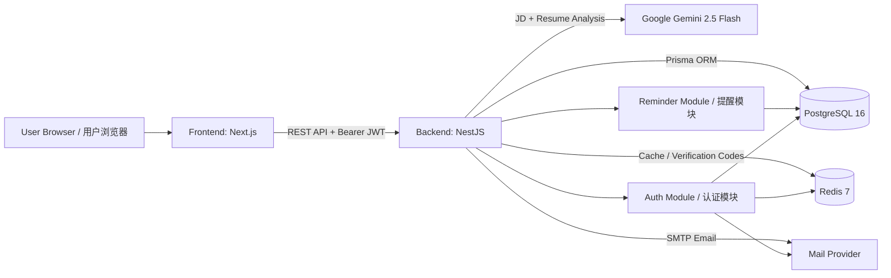
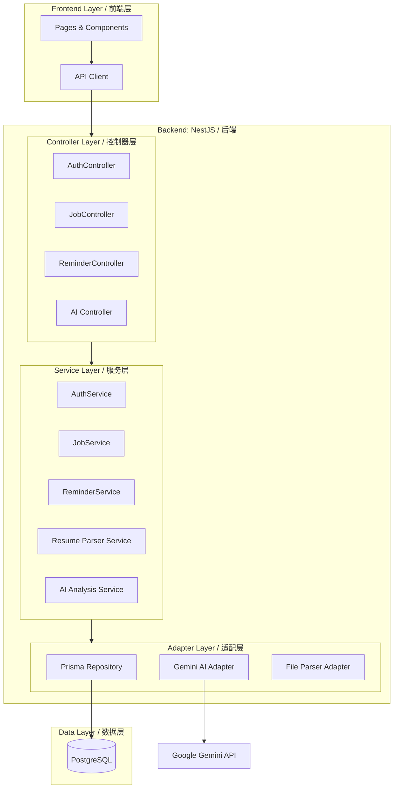
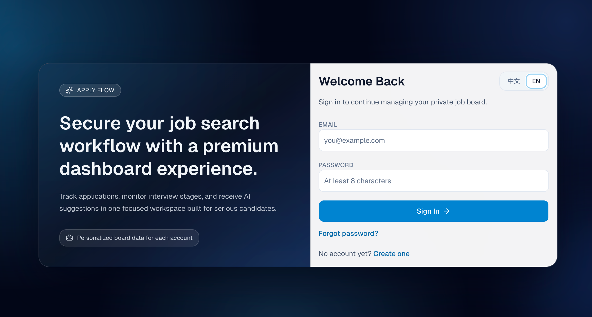
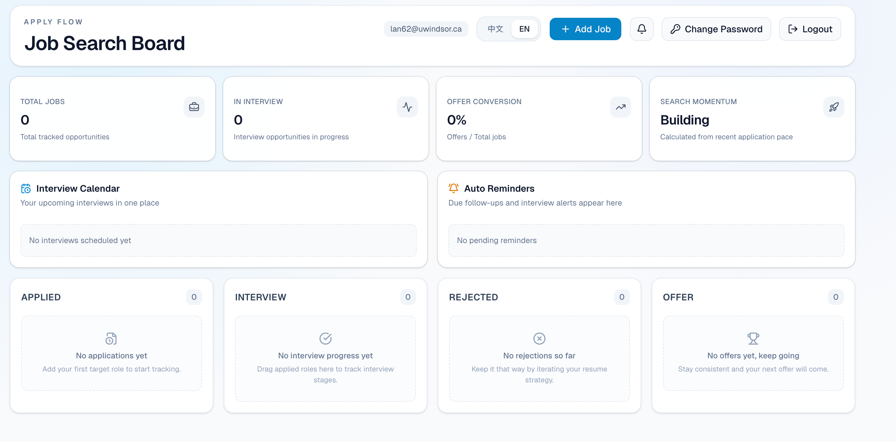
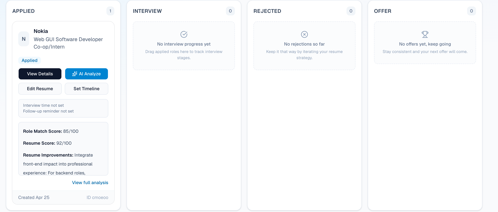
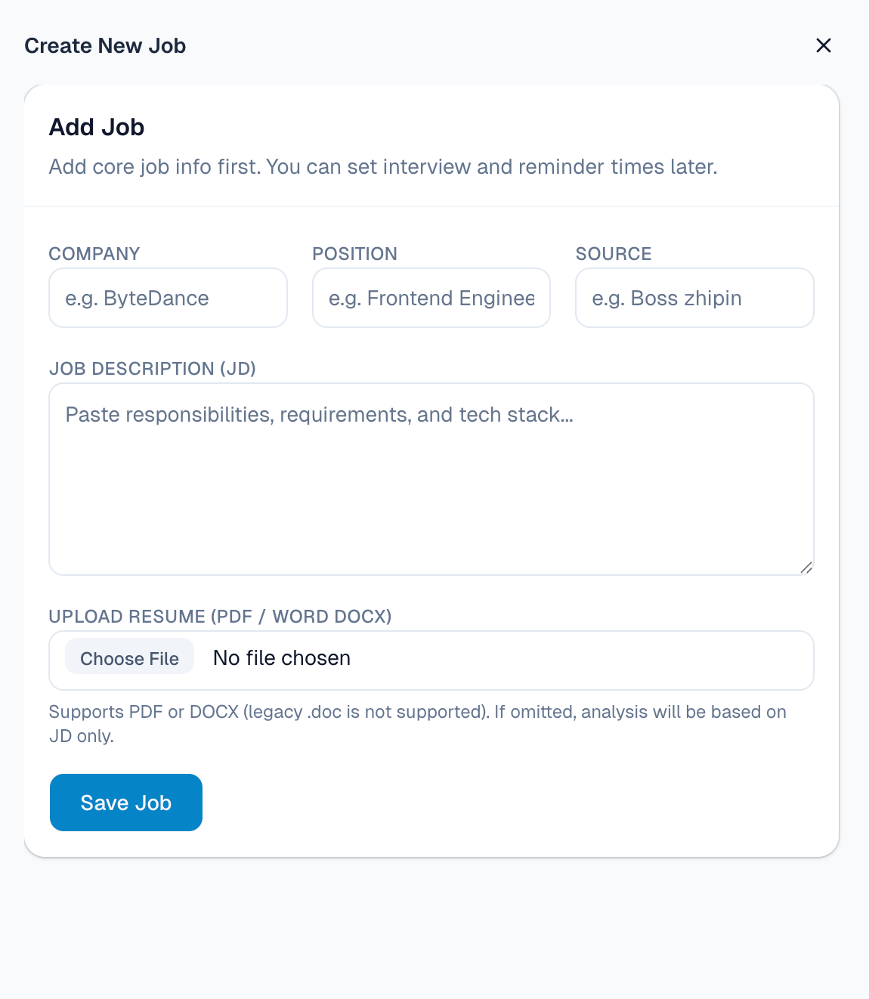
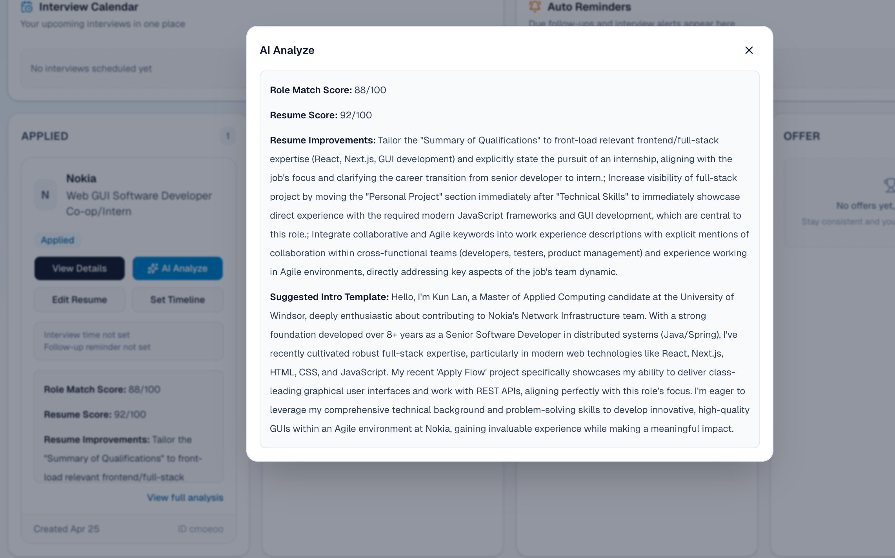

# Apply Flow

Apply Flow is an AI-powered job search dashboard in a monorepo setup. It supports account authentication with email verification codes, application tracking, reminder workflows, and AI analysis based on JD + resume text.

## Tech Stack

- Frontend: Next.js 16, React 19, Tailwind CSS 4, dnd-kit, shadcn/ui
- Backend: NestJS 11, Prisma 6, JWT (Bearer token auth)
- Data: PostgreSQL 16, Redis 7
- Mail: Nodemailer SMTP
- AI: Google Gemini (`gemini-2.5-flash`)
- Tooling: pnpm workspace, Turborepo, ESLint, Prettier, Docker Compose

## Repository Structure

```text
.
├─ apps/
│  ├─ frontend/     # Next.js frontend app
│  └─ backend/      # NestJS backend app
├─ packages/        # Shared configs/components
├─ prisma/          # Prisma schema
├─ docker-compose.yml
└─ turbo.json
```

## System Architecture / 系统架构



### Request Flow (High Level) / 请求流程（高层）

1. User interacts with pages in the Next.js frontend.  
   用户在 Next.js 前端页面中完成交互。
2. Frontend sends authenticated requests to NestJS backend using `Authorization: Bearer <token>`.  
   前端通过 `Authorization: Bearer <token>` 向 NestJS 后端发送认证请求。
3. Backend handles business logic (auth, jobs, reminders, resume parsing) and persists data via Prisma + PostgreSQL.  
   后端处理业务逻辑（认证、职位、提醒、简历解析），并通过 Prisma + PostgreSQL 持久化数据。
4. For AI analysis, backend sends normalized JD/resume text to Gemini and stores structured results.  
   AI 分析场景下，后端会将标准化后的 JD/简历文本发送给 Gemini，并存储结构化结果。

## Detailed Module Layers / 模块分层图（细化）



## System Interface / 系统界面

### Main Screens / 主要页面

- Login/Register page: user authentication and session initialization.  
  登录/注册页面：用户认证与会话初始化。
- Forgot Password page: send code by email and reset password.  
  忘记密码页面：邮箱验证码校验并重置密码。
- Change Password page: logged-in user changes password with verification code.  
  修改密码页面：已登录用户通过验证码修改密码。
- Dashboard page: overall application status and reminder overview.  
  仪表盘页面：展示投递整体状态与提醒概览。
- Job Board page: create/update job applications and manage status flow.  
  职位看板页面：创建/更新投递记录并管理状态流转。
- Job Detail page: view JD, resume analysis, and suggested improvements.  
  职位详情页面：查看 JD、简历分析与优化建议。
- Reminder Center page: mark read, ignore, snooze, and bulk operations.  
  提醒中心页面：已读、忽略、稍后提醒及批量处理。
- Language Switch: Chinese/English UI toggle.  
  语言切换：中英文界面切换。

### Screenshot Paths / 截图路径

| Auth | Dashboard |
| --- | --- |
|  |  |

| Job Board | Add Job |
| --- | --- |
|  |  |

| AI Analysis |
| --- |
|  |

## Quick Start (Recommended: Docker)

### 1) Prepare environment variables

```sh
cp .env.example .env
```

Set root `.env` for:

- `SMTP_*` to enable verification code emails
- `GEMINI_API_KEY` optionally for AI analysis

### 2) Start all services

```sh
pnpm docker:up
```

### 3) Service URLs

- Frontend: `http://localhost:3000`
- Backend: `http://localhost:3001`
- PostgreSQL: `localhost:5432`
- Redis: `localhost:6379`

### 4) Useful commands

```sh
pnpm docker:logs
pnpm docker:down
pnpm docker:build
```

## Local Development

### 1) Install dependencies

```sh
pnpm install
```

### 2) Start databases

- Start DB + Redis via Docker:

```sh
docker compose up -d db redis
```

- Or use your own local PostgreSQL instance.

### 3) Prepare backend env file

```sh
cp apps/backend/.env.example apps/backend/.env
```

Update `DATABASE_URL`, `REDIS_URL`, `FRONTEND_URL`, `JWT_SECRET`, and `SMTP_*` as needed (`GEMINI_API_KEY` is optional).

### 4) Sync Prisma

```sh
pnpm --filter backend prisma:generate
pnpm --filter backend prisma:push
```

### 5) Start frontend and backend

Run from repo root:

```sh
docker compose up -d frontend backend
```

Default ports:
- Frontend: `3000`
- Backend: `3001`

## Common Scripts

```sh
pnpm dev
pnpm build
pnpm lint
pnpm check-types
pnpm format
```

## Core Features

- Auth system: register/login/logout/me with 6-digit email verification code
- Password recovery: forgot password (send code) + reset password
- Password management: authenticated user change password (send code + submit code)
- Job board: CRUD + status flow (`APPLIED`/`INTERVIEW`/`REJECTED`/`OFFER`)
- Resume processing: parse PDF and DOCX text (`.doc` is not supported)
- AI analysis: structured JSON output (match score, resume score, improvements, intro template)
- Reminder management: mark read, ignore, snooze, bulk mark read
- Language support: Chinese / English UI switching
- Mail fallback logging: when SMTP fails/unconfigured, backend logs code and error reason for debugging

## Areas for Improvement

- Integrate with major resume/job platforms to fetch each user's submitted applications.
- Let users choose their preferred AI model, with support for multiple model providers.
- Add OCR support for image-based and scanned PDF resumes.

## More Docs

- Frontend docs: `apps/frontend/README.en.md`
- Backend docs: `apps/backend/README.en.md`
